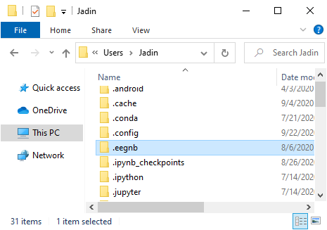

# Loading and Saving Data
Knowing where the data is saved is integral to the functionality of EEG Notebooks. EEG Notebooks saves data to a default location in a hidden directory. From this directory, the individual files can be found based on a folder structure outlined below in the **naming convention.**

## Locating the Default Data Directory

#### Windows 10
The default directory is found at the location `C:\Users\*USER_NAME*\.eegnb` an example of which is pictured below.


#### Linux

#### MacOS

## Changing the Default Data Directory
The default directory for saving data is automatically set within the library. If you want to save and analyze data to/from a new directory, it must be passed as a parameter to both the `eegnb.generate_save_fn()` and `eegnb.analysis.load_data()` functions.

**Saving to new directory:**
``` python
from eegnb import generate_save_fn
from eegnb.experiments.visual_n170 import n170

# Define session parameters
board = 'cyton'
experiment = 'visual-N170
subject = 1
session = 1

# Define new directory and generate save filename
new_dir = 'C:/Users/Jadin/Documents/EEG_Notebooks_Data'
save_fn = generate_save_fn(board, experiment, subject, session, new_dir)

# Continue to run experiment as normal...
```

**Loading from new directory:**
``` python
from eegnb.analysis.utils import load_data

# Define parameters for session you want to load
board = 'cyton'
experiment = 'visual-N170
subject = 1
session = 1

# Define new directory
new_dir = 'C:/Users/Jadin/Documents/EEG_Notebooks_Data'

# Load data
raw = load_data(
            subject_id = subject,
            session_nb = session,
            device_name = board,
            experiment = experiment,
            data_dir = new_dir
        ) 
```

## Naming Convention
From the specified data directory, EEG notebooks then follows a specific set of naming conventions to define subdirectories and save the data. The full path ends up taking the form
```
DATA_DIR\experiment\site\device\subject#\session#\file_name.csv
```
Each field is explained below:

**Experiment:** This part is the name of the experiment being run. Example names of experiments as they appear in the example datasets are shown below.
```
visual-N170
visual-P300
visual-SSVEP
```

**Site:** The site refers to the recording location, or generally the machine it was recorded to. If you are saving and analyzing only your own data on your local machine, you do not need to specify your site name as it will default to 'local'. When loading example datasets however, it is necessary to specify from which site you would like to load data.

**Device:** The name of the device being recorded from.

**Subject #:** When entering subject ID as a parameter, you only need to specify the integer value. The integer will be formatted to `subjectXXXX` where "XXXX" is a four-digit representation of the integer ID#. 

**Session #:** A session in this case would be the full period of time which you have the device on and are taking multiple recordings. For example: if you put the headset on and take five recordings, all five of these recording would belong to session number 1. Once you take a break from consecutive recordings, then this would constitute a new session. Just like the subject ID, this value is passed as an integer and gets converted to a read-able format.

**File name:** The file name is automatically generated in the format `recording_date_time.csv`

### Examples